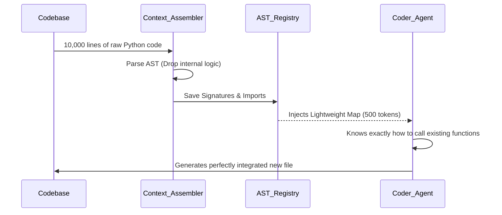

# Context Agent: Comprehensive Architectural History & Autonomy Roadmap

## Part 1: The Ultimate Bottleneck - The LLM Context Window

The development of the Context Agent began with a singular, fundamental problem that plagues all Artificial Intelligence coding systems: **The Context Window Constraint**.

An LLM's context window is its working memory. It is a hard limit on the number of tokens (words/characters) the model can "see" and reason about at any given moment. When building enterprise-grade software, this limitation manifests in three catastrophic failure modes:

### Case 1: Massive Input
**The Problem:** The existing codebase or the user's prompt is larger than the LLM can read.
If you have a monorepo with 100,000 lines of code, you cannot simply paste it into a prompt and ask the LLM to "add a feature to the billing module." The input exceeds the context window, causing the LLM to either outright reject the prompt (e.g., `HTTP 413 Payload Too Large`) or, worse, selectively "forget" the beginning of the prompt, leading to severe hallucinations and broken code.

### Case 2: Massive Output
**The Problem:** The requested application requires more tokens to generate than the LLM can output in a single response.
If a user prompts the AI to "Build an entire operating system like Ubuntu," the LLM understands the request but physically cannot generate the millions of lines of code required in a single generation stream. It will abruptly stop mid-sentence when it hits its output token limit (e.g., `max_tokens=8192`).

### Case 3: The Singularity (Massive Input + Massive Output)
**The Problem:** The ultimate challenge where both the starting state (a massive existing codebase) and the goal (a massive new feature set) exceed the LLM's limits simultaneously. This is the reality of production software engineering.

Context Agent was designed from Day 1 specifically to break these limitations.

---

## Part 2: Day 1 - The Genesis & Tackling Case 2 (Massive Output)

In the early days of AI coding assistants, the prevailing architecture was the **Multi-Agent DAG (Directed Acyclic Graph)**. In these systems, a "Developer Agent" would write code, pass it to a "Reviewer Agent" for critique, and pass it to a "QA Agent" for testing. 

**Why Multi-Agent DAGs Failed Initially:**
These systems frequently collapsed into non-deterministic infinite loops. A developer agent would write a function, but because it didn't have the context of the entire codebase, it would call nonexistent methods. The reviewer agent would catch the error, send it back, and the developer agent would rewrite it—still blindly. *Multi-agent systems failed because they lacked a persistent, accurate map of the codebase.*

> **Architectural Note on Multi-Agent Feasibility:** It is important to note that Multi-Agent architectures are not inherently flawed. With the innovations we built later (specifically the AST File Registry), Multi-Agent architectures *can* be achieved effectively. However, we began by building a **Deterministic Single-Loop Orchestrator** to guarantee stability and prove the core concepts.

### Solving Case 2: The Planner Agent & Dependency Graphs

To solve **Case 2 (Massive Output)**, we realized we could never ask the LLM to write the whole application at once. 

Instead, we introduced the **Planner**. When a user says "Build a CLI calculator," the Planner does not write code. Its sole job is to break the massive output down into granular, microscopic files, ordered by their **dependency graph**. 

The Planner knows that `utils.py` must be written *before* `main.py`, because `main.py` depends on `utils.py`. By forcing the LLM to generate only one file at a time, we completely bypass the massive output limit.

```mermaid
graph TD
    A[Massive User Prompt: "Build Ubuntu"] --> B(Planner Agent)
    
    B --> C[Step 1: Write core/kernel_math.py]
    B --> D[Step 2: Write core/memory_manager.py]
    B --> E[Step 3: Write drivers/disk_io.py]
    B --> F[Step 4: Write main.py]
    
    C --> D
    D --> E
    E --> F
    
    style A fill:#ff9999,stroke:#333,stroke-width:2px
    style B fill:#99ccff,stroke:#333,stroke-width:2px
    style F fill:#99ff99,stroke:#333,stroke-width:2px
```

---

## Part 3: Tackling Case 1 (Massive Input) & The Context Assembler

With the output problem solved, we faced the input problem. As the Orchestrator loops through the Planner's steps, the codebase grows. By Step 50, the project might contain 20,000 lines of code. 

**The Context Loss Spiral:**
If we feed all 20,000 lines of previously written code into the prompt for Step 51, we hit **Case 1 (Massive Input)**. The LLM's reasoning degrades, context limits are breached, and token costs explode.

### The Innovation: The AST File Registry

To solve this, we built the **Context Assembler**. Instead of passing full files, the Assembler uses Python's native `ast` (Abstract Syntax Tree) module. 

Every time a file is written, the Context Assembler parses it and extracts only the structural skeleton:
- Class definitions
- Method signatures
- Function signatures (with type hints)
- Module imports

**100,000 lines of raw code are compressed into a lightweight, highly accurate "map" of the codebase.** The LLM doesn't need to see the internal `for` loops inside `calculate_tax()`; it only needs to see `def calculate_tax(amount: float) -> float` to know how to call it.



By combining the **Dependency Graph Planner** (solving Massive Output) and the **AST File Registry** (solving Massive Input), the Context Agent conquered the Context Window Bottleneck, paving the way for truly massive AI-generated architectures.
