# Context Agent — Architecture & Approach Document

---

## Table of Contents

1. [Executive Summary](#1-executive-summary)
2. [The Core Problem: The LLM Context Window Bottleneck](#2-the-core-problem-the-llm-context-window-bottleneck)
3. [Foundational Design Decision: Single-Loop vs. Multi-Agent](#3-foundational-design-decision-single-loop-vs-multi-agent)
4. [Solving the Output Bottleneck: The Planner & the Dependency Graph](#4-solving-the-output-bottleneck-the-planner--the-dependency-graph)
5. [Solving the Input Bottleneck: The Context Assembler & AST File Registry](#5-solving-the-input-bottleneck-the-context-assembler--ast-file-registry)
6. [End-to-End System Architecture](#6-end-to-end-system-architecture)
7. [The Orchestrator Loop in Detail](#7-the-orchestrator-loop-in-detail)
8. [The AST File Registry — Deep Dive](#8-the-ast-file-registry--deep-dive)
9. [Verification & Self-Healing Loop](#9-verification--self-healing-loop)
10. [Security & Sandboxing Model](#10-security--sandboxing-model)
11. [System Component & Directory Map](#11-system-component--directory-map)
12. [Problem → Solution Traceability Matrix](#12-problem--solution-traceability-matrix)
13. [What Has Been Solved So Far](#13-what-has-been-solved-so-far)
14. [Forward-Looking Note: Multi-Agent Feasibility](#14-forward-looking-note-multi-agent-feasibility)
15. [Operational Reference: Running the System](#15-operational-reference-running-the-system)
16. [Glossary](#16-glossary)

---

## 1. Executive Summary

Context Agent is an advanced autonomous, agentic coding system. A user describes an application in natural language, and the system architecturally plans it, writes it file-by-file, performs deep semantic analysis on every file, automatically patches complex bugs, and seamlessly evolves the codebase through iterative follow-up requests without destroying past work.

What makes the system worth documenting in detail is not the chatbot loop on top — it's the robust engineering underneath that loop, which exists entirely to defeat the structural limitations of large language models. The system relies on four architectural pillars:

| Pillar | Defeats | Mechanism |
|---|---|---|
| **Hierarchical Master Planner** | Massive Output | Breaks massive generation requests into Subsystems, Services, and Modules in a dependency-ordered sequence. |
| **Iterative Update Planning** | The Evolution Bottleneck | Evaluates follow-up prompts using Intent Routing and appends surgical `[NEW]` or `[MODIFY]` steps to an existing architecture dynamically. |
| **AST Registry + Neo4j Graph** | Massive Input | Compresses the codebase into structural signatures and uses graph traversal to inject only topologically relevant context to the LLM. |
| **Deep Semantic Fixer Loop** | Generation Errors | Runs Ruff, Pyright, and Semgrep to catch deep logic/type/security errors, then patches them autonomously using precise `<edit_file>` search/replace blocks. |

The result is a **Deterministic Single-Loop Orchestrator**: one predictable control loop (rather than a chaotic web of cooperating agents) that plans, writes, checks, and fixes — file by file — until the full application exists and evolves flawlessly.

---

## 2. The Core Problem: The LLM Context Window Bottleneck

### 2.1 Why this matters

Every LLM has a hard ceiling on how many tokens (roughly: words and code symbols) it can process in one request and produce in one response. This is its **context window**. For a chatbot answering questions, this ceiling is rarely felt. For a system that is asked to *write entire software projects*, it is the single most limiting constraint in the whole design — and it shows up in three distinct ways.

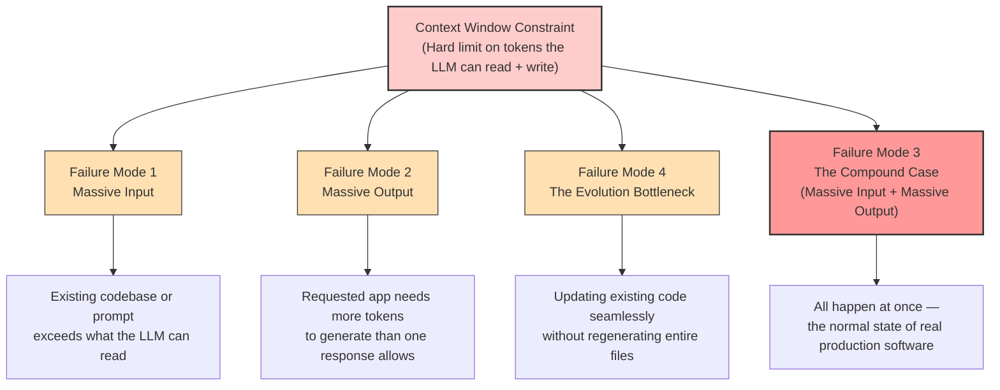

### 2.2 Failure Mode 1 — Massive Input

If a codebase has, say, 100,000 lines of code spread across a monorepo, it cannot simply be pasted into a prompt with an instruction like *"add a feature to the billing module."* The input either:

- Gets rejected outright (`HTTP 413 Payload Too Large`), or
- Gets silently truncated, causing the model to "forget" earlier parts of the prompt — which produces hallucinated function calls and broken integrations.

### 2.3 Failure Mode 2 — Massive Output

If a user asks for something genuinely large — *"build an entire operating system"* — the model understands the request perfectly well, but it **physically cannot** emit the millions of lines required in a single response. It runs into its own output token ceiling (e.g. `max_tokens=8192`) and stops mid-file, mid-function, sometimes mid-line.

### 2.4 Failure Mode 4 — The Evolution Bottleneck

Once a massive project is built, users inevitably want to update it. If a user asks to *"add a dark mode toggle to the frontend"*, traditional agents attempt to rewrite the entire frontend file from scratch. This frequently breaks existing logic, wastes massive amounts of tokens, and destroys the integrity of previously verified code.

### 2.5 Failure Mode 3 — The Compound Case

This is the real-world scenario for production engineering: you already have a large, established codebase (Failure Mode 1), you're asking for a large new feature set on top of it (Failure Mode 2), and you need it injected into existing files seamlessly (Failure Mode 4), simultaneously. Neither problem can be solved in isolation — solving them cohesively is the entire reason the V2 architecture exists.

---

## 3. Foundational Design Decision: Single-Loop vs. Multi-Agent

Before any of the three failure modes could be addressed, a foundational architecture decision had to be made: **how should the system organize its own reasoning?**

The dominant pattern at the time was the **Multi-Agent DAG** (Directed Acyclic Graph): a "Developer Agent" writes code, hands it to a "Reviewer Agent" for critique, which hands it to a "QA Agent" for testing, and so on.

In practice, this pattern tended to collapse into **non-deterministic infinite loops**. A developer agent, lacking a real map of the codebase, would invent calls to functions that didn't exist. The reviewer agent would catch the mistake and send it back — and the developer agent, still blind to the actual codebase, would make a *different* wrong guess. The root cause wasn't the multi-agent pattern itself; it was the absence of **a persistent, accurate map of the codebase** that every agent could trust.

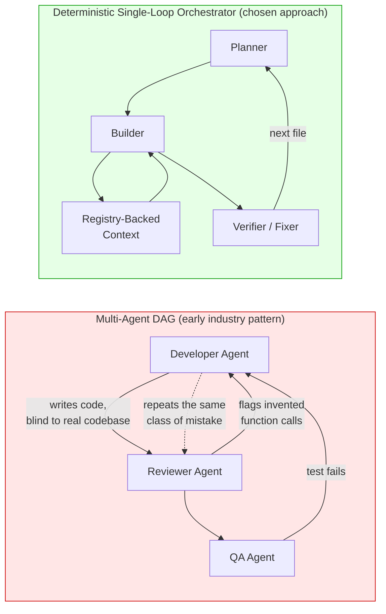

**Design decision:** Build a Deterministic Single-Loop Orchestrator first, to prove the core concepts — Planning, Context Assembly, Verification — under conditions that are easy to reason about and debug. Multi-agent collaboration is **not** treated as fundamentally unworkable; it is treated as *premature* until the system has a reliable shared map of the codebase. (This point is revisited in [Section 14](#14-forward-looking-note-multi-agent-feasibility).)

---

## 4. Solving the Output Bottleneck: The Master Planner (V2)

### 4.1 Hierarchical System Vision & Scale Classification

The system never asks the LLM to write an entire application in one generation. Instead, a dedicated **Master Planner** categorizes the complexity of the prompt into four scales:
- **Simple (1-5 files)**: Single scripts, calculators.
- **Medium (5-30 files)**: Standard web apps, CLI tools.
- **Large (30-100 files)**: Coding agents, full-stack platforms.
- **Massive (100+ files)**: Cloud OS, ERPs.

For Large and Massive projects, the planner decomposes the request into a rigid, multi-stage hierarchy:
1. **Vision**: Deduces overarching architectural constraints.
2. **Epics & Subsystems**: Breaks the system into logical domains (e.g. `Compute Fabric`, `Distributed Storage`).

### 4.2 JIT (Just-In-Time) Epic Planning

If a project is classified as **Massive** (100+ files), generating the entire file plan upfront would cause the LLM context window to overflow and crash. To prevent this, the system dynamically switches to **JIT (Just-In-Time) Epic Planning**.
1. The user approves the high-level **Architecture Epics**.
2. The orchestrator takes Epic 1 and plans *only* the specific Services and Modules for that Epic.
3. It executes (codes, tests, fixes) Epic 1 completely.
4. It then moves to Epic 2, plans its files, and repeats.

By forcing generation down to **one Epic at a time**, the system never asks the LLM to exceed its output ceiling, allowing for infinite scaling.

### 4.3 Iterative Update Planning (Solving Evolution)

To solve the Evolution Bottleneck (Failure Mode 4), the `MasterPlanner` features a secondary pipeline: `generate_update_plan()`.
When a user submits a follow-up request on an existing project, the system performs **Intent Routing**:
- If it's a bug fix, it's routed directly to the Semantic Fixer.
- If it's a feature update, the Master Planner reads the current Graph and AST Registry, and emits a highly surgical delta of `PlanSteps` marked as `[NEW]` (for creating missing files) or `[MODIFY]` (for updating existing files).

These steps are appended directly to the `ProjectState`, allowing the Coder agent to use `<edit_file>` tags to surgically inject the new logic without wiping the old code.

### 4.3 Example: decomposing a massive request

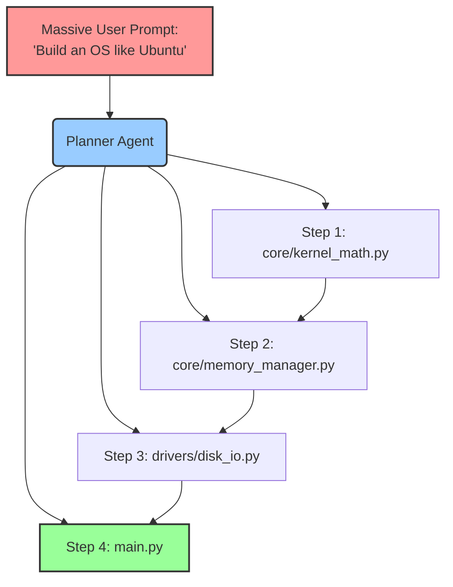

Each box above is generated in its **own**, independent LLM call. No matter how many boxes the dependency graph contains, none of them individually risks hitting the output ceiling — **Failure Mode 2 is solved.**

---

## 5. Solving the Input Bottleneck: The Context Assembler & AST File Registry

### 5.1 The problem the Planner alone doesn't solve

Solving the output problem creates a new one. As the Orchestrator works through the plan, the codebase grows with every file written. By the fiftieth file, the project might already contain 20,000 lines of code. If all of that is fed back into the prompt for file fifty-one, the system runs straight into **Failure Mode 1** — the LLM's reasoning degrades, the context window is breached, and token costs spiral. This is referred to as the **Context Loss Spiral**.

### 5.2 The innovation: structural compression, not truncation

The fix is not to feed *less* of the codebase by cutting it off arbitrarily — that would lose exactly the information the LLM needs. Instead, the system feeds a **structurally complete but textually tiny** representation of the codebase, built using Python's native `ast` (Abstract Syntax Tree) module.

Every time a file is written, the **Context Assembler** parses it and keeps only:

- Class definitions
- Method signatures
- Function signatures, including type hints
- Module-level imports

Everything else — every `for` loop, every conditional, every line of actual logic — is discarded from what the LLM sees going forward. The LLM doesn't need to see the internals of `calculate_tax()`; it only needs to see `def calculate_tax(amount: float) -> float` to call it correctly.

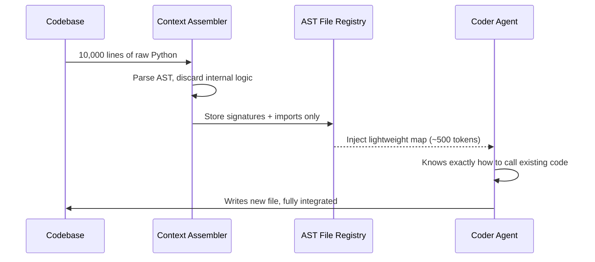

### 5.3 What this looks like in practice

A 10,000-line module can collapse into something as small as:

```python
# Available Files in Workspace:
# src/math_ops.py
def add(a: float, b: float) -> float: ...
def subtract(a: float, b: float) -> float: ...
```

That handful of lines carries everything the model needs to call those functions correctly, at a fraction of a percent of the token cost of the original file. **Failure Mode 1 is solved** — and because it's solved independently of the Planner's solution to Failure Mode 2, **Failure Mode 3, the compound case, is solved as a direct consequence of solving the first two.**

---

## 6. End-to-End System Architecture

### 6.1 High-level components

The system consists of a **Python FastAPI backend** handling REST APIs and WebSockets for live streaming of generation progress.

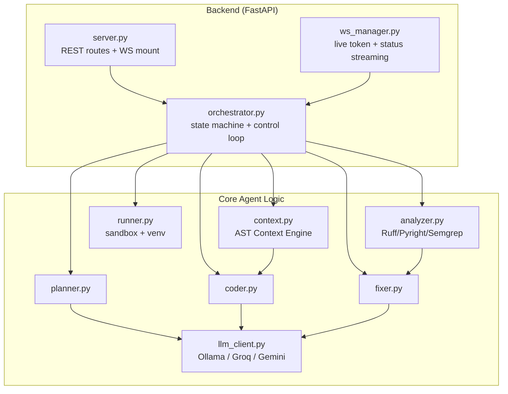

### 6.2 The Orchestrator Pipeline

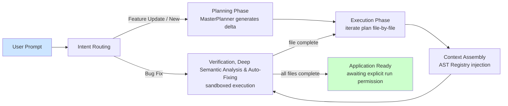

---

## 7. The Orchestrator Loop in Detail

Once a plan is approved by the user, the **Builder Agent** executes it. It never attempts the whole application in one prompt — it runs a **Repeated Iteration Loop**, one cycle per planned file.

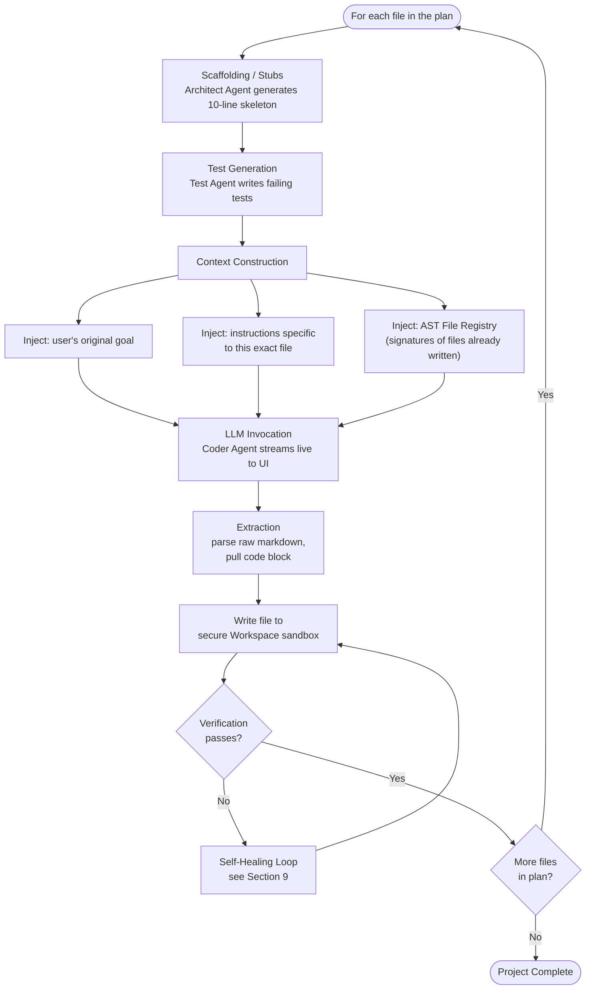

Three details matter here:

1. **Scaffolding (Skeleton Generation) first**: Before actual logic is written, the `ArchitectAgent` creates structural "stubs" for every file in the Epic. This populates the AST registry with perfectly accurate class names and function signatures, completely eliminating "Module Not Found" errors when the `CoderAgent` eventually tries to stitch files together.
2. **Context Construction** is rebuilt fresh for every single file — it never grows unbounded, because it draws on the *compressed* registry rather than the raw, ever-growing codebase.
3. **Extraction & Surgical Editing**: The Coder agent supports advanced XML tooling. It can either overwrite files with `<write_file>`, or use `<edit_file>` to surgically inject features via `<<<<<<< SEARCH` and `>>>>>>> REPLACE` blocks, entirely preserving the integrity of existing code.

---

## 8. The AST File Registry — Deep Dive

### 8.1 The problem it specifically targets: "code stitching"

The single biggest practical failure mode in AI-generated software is **code stitching** — the model forgets the exact name or signature of a function it wrote a few steps earlier and invents a slightly different one, silently breaking the integration between files.

### 8.2 Why AST parsing, specifically

Two alternatives were available and rejected:

| Approach | Problem |
|---|---|
| Re-send the full file every time | Re-introduces Failure Mode 1 (massive input) as the codebase grows |
| Re-send a free-text summary of the file | Summaries drift, hallucinate, or omit details the model actually needs |
| **AST-based signature extraction (chosen)** | Deterministic, exact, and small — there is no "interpretation" step that can introduce error |

Because the registry is built from the **actual parsed syntax tree** rather than a paraphrase, the function signatures the LLM sees are *guaranteed* to be correct — there is no risk of summarization drift.

### 8.3 What "concrete" means here

The registry doesn't just say "this file has an `add` function." It preserves the literal calling contract: parameter names, parameter types, and return types, exactly as written. This is what makes it possible for a file written in step 51 to call a function from step 3 with zero ambiguity, even though the LLM never saw a single line of that function's actual implementation.

### 8.4 Graph-Filtered Context Assembly (The Neo4j Upgrade)

While the AST File Registry successfully compresses a 10,000-line file into a handful of lines, what happens when a massive project contains 10,000 *files*? Even the compressed signatures would eventually overwhelm the context window.

To completely break the context window limitation, the system integrates a **Neo4j Knowledge Graph** (Graphifyy). 

When the Context Assembler prepares the prompt for the Coder or Fixer agent, it doesn't blindly inject the AST signatures for the entire repository. Instead, it executes a live graph traversal query (`MATCH (f:File)-[*1..2]-(other_f:File)`) to find the structural nearest neighbors of the file currently being worked on. 

The LLM is only injected with the exact API signatures of files that are topologically connected to its current task. The rest of the repository remains completely hidden, ensuring the context remains mathematically bounded and incredibly cheap, no matter how infinitely large the overall codebase scales.

#### 8.4.1 Neo4j Multi-Tenant Project Isolation
Because the system uses Neo4j Community Edition (which only supports a single active database), all workspaces are technically stored in the same graph instance. To ensure absolute data isolation, the system uses **Project Namespacing**. Every node ingested into the graph is tied to a `Project` node. When the Context Engine queries for relational context, it strictly filters the traversal: `MATCH (p:Project {name: $project_name})-[*0..]-(n)`. This mathematically guarantees that cross-project data leakage is impossible.

### 8.5 Behavioral Scaling via Google's Open Knowledge Format (OKF)

As the project scales structurally, it must also scale *behaviorally*. When an AI generates hundreds of files, it inherently suffers from "rule drift"—it slowly forgets overarching design philosophies, language-specific paradigms, and security guardrails that were defined in the very first prompt.

To combat this, the Context Agent integrates **Google's Open Knowledge Format (OKF)**. OKF is a strict, highly-structured markdown paradigm designed specifically for autonomous systems.

**How OKF Integration Works in the Agent:**
1. **Persistent Memory Storage:** All domain-specific constraints are documented as `.md` files in a dedicated `.agent_brain/knowledge/` directory.
2. **Immutable Injection:** During Context Assembly, before the AST Registry or the Plan Steps are added, the Orchestrator reads all OKF files and injects them directly into the **highest-priority layer of the LLM's System Prompt**.
3. **Unshakeable Alignment:** Because these OKF rules sit at the core system level rather than the volatile user-prompt level, they become inviolable constraints. The agent cannot drift from its architectural philosophy because the rules are permanently anchored into its cognitive framework at every single execution step.

Whether it's enforcing rigorous PEP8 standards, maintaining a strict neon-dark UI theme across 50 components, or mandating specific database indexing strategies, OKF guarantees that the agent's behavior remains hermetically aligned with the original vision, completely breaking the context-memory decay typically seen in long-running autonomous tasks.

---

## 9. Verification, Deep Semantic Analysis & Self-Healing Loop

The system does not trust the LLM to produce perfect code on the first attempt. Every file passes through a multi-layered autonomous verification and repair cycle before the Orchestrator considers it complete.

### 9.1 The Deep Semantic Analyzer (`core/analyzer.py`)

Before any auto-fixing is attempted, the Orchestrator invokes the **StaticAnalyzer**, which orchestrates three industry-grade semantic analysis tools securely inside the project's virtual environment:

1. **Ruff** (`ruff check`): Executes lightning-fast analysis to catch syntax violations, missing imports, and basic linting errors.
2. **Pyright** (`pyright`): Performs deep semantic type-checking. It traverses the entire project graph to catch logic errors, mismatched function signatures, and complex inheritance issues that basic linters miss.
3. **Semgrep** (`semgrep scan`): Scans the codebase's Abstract Syntax Tree (AST) for security vulnerabilities, hardcoded secrets, and complex architectural anti-patterns.

### 9.2 The Autonomous Fixer Pipeline

The `StaticAnalyzer` captures the JSON output from all three tools (Ruff, Pyright, and Semgrep) and aggregates them into a highly structured Fix Prompt. 

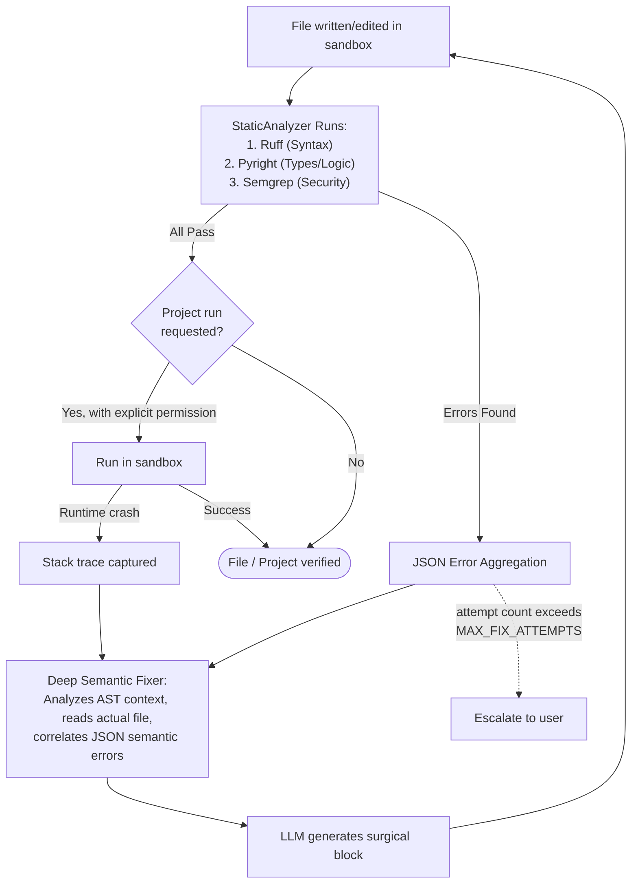

Key properties of this loop:

- **Two layers of checking**: a fast syntax-only check at write time, and a deeper runtime check when the user opts to actually execute the project.
- **Bounded retries**: the fix loop repeats up to `MAX_FIX_ATTEMPTS` times automatically — it does not retry forever, and escalates to the user if it can't converge.
- **No silent failure**: every fix attempt is built from the *exact* traceback the sandbox produced, not a guess.

---

## 10. Security & Sandboxing Model

Because the agent executes code automatically and without manual review of every line, security is treated as a first-class design constraint, not an afterthought.

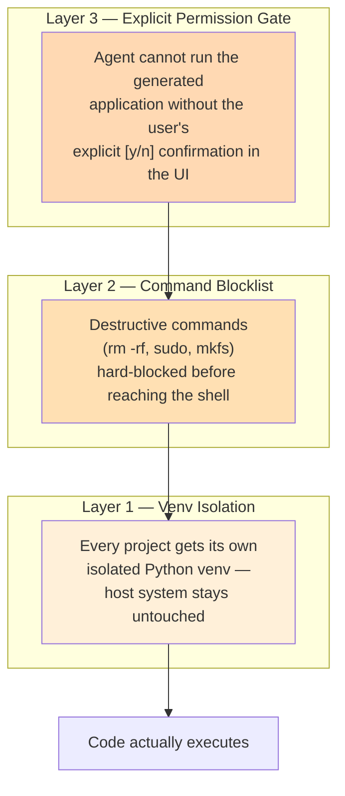

Each layer is independent of the others — a request would have to pass the permission gate **and** clear the blocklist **and** still only ever touch its own isolated environment, before anything runs on the host machine.

---

## 11. System Component & Directory Map

```mermaid
flowchart TB
    Root["Project Root"] --> BE[backend/]
    Root --> Core[core/]
    Root --> Mod[models/]
    Root --> UI[ui/]
    Root --> Proj[projects/]
    Root --> RootFiles["Root files:<br/>cli.py, config.py, main.py,<br/>knowledge.json, start.sh/.bat"]

    BE --> server[server.py]
    BE --> orch[orchestrator.py]
    BE --> wsm[ws_manager.py]

    Core --> coder[coder.py]
    Core --> context[context.py]
    Core --> fixer[fixer.py]
    Core --> llmc[llm_client.py]
    Core --> planner[planner.py]
    Core --> runner[runner.py]
    Core --> analyzer[analyzer.py]
    
    Root --> Brain[core/brain/]
    Brain --> kg[knowledge_graph.py]
    Brain --> pb[project_brain.py]

    Root --> Retr[core/retrieval/]
    Retr --> ss[semantic_store.py]
    Retr --> ce[context_engine.py]

    Root --> Agt[core/agents/]
    Agt --> sum[summarizer.py]

    Mod --> state[state.py]

    UI --> termui[terminal_ui.py]

    Proj --> sandboxes["Per-project sandboxes,<br/>each with its own venv"]
```

| Path | Responsibility |
|---|---|
| `backend/server.py` | Main entry point; REST routes (`/api/health`, `/api/projects`); mounts WebSocket endpoints |
| `backend/orchestrator.py` | The control loop's "central nervous system" — manages the state machine, drives the Planner and Coder, runs execution + self-healing |
| `backend/ws_manager.py` | Streams live LLM tokens and execution status to the frontend |
| `core/coder.py` | Parses raw LLM responses, extracts code blocks, writes them securely to disk |
| `core/context.py` | The AST Context Engine — builds the condensed File Registry of signatures |
| `core/fixer.py` | Analyzes tracebacks, auto-installs missing packages, builds fix prompts |
| `core/llm_client.py` | Async wrapper around LLM providers; handles token estimation, SSE streaming, backoff |
| `core/planner.py` | Generates the dependency-ordered implementation plan |
| `core/runner.py` | Sandbox engine — syntax checks, venv management, non-interactive execution |
| `core/analyzer.py` | Deep semantic analysis using Ruff, Pyright, and Semgrep to generate JSON bug reports |
| `core/brain/knowledge_graph.py` | Neo4j integration; maps AST structural dependencies |
| `core/retrieval/semantic_store.py` | ChromaDB integration; semantic search for files and plan histories |
| `core/agents/summarizer.py` | Analyzes generated files and writes ultra-dense functional summaries |
| `core/planners/master_planner.py` | V2 Hierarchical Planner (Vision -> Subsystems -> Services -> Modules) |
| `models/state.py` | Pydantic schemas for `ProjectState`, `PlanStep`, `FileEntry` |
| `ui/terminal_ui.py` | Rich-library terminal interface, an alternative to the web UI |
| `projects/` | Isolated, per-project sandboxes, each with its own venv |
| `cli.py` | Command-line entry point |
| `config.py` | Centralized configuration — token budgets, API keys, LLM settings |
| `main.py` | Secondary/legacy entry point |
| `knowledge.json` | Persistent memory — integration guidelines and known "gotchas" |
| `start.sh` / `start.bat` | Cross-platform scripts to boot backend + frontend together |

---

## 12. Problem → Solution Traceability Matrix

| Failure Mode | Symptom Without a Fix | Component That Solves It | Mechanism |
|---|---|---|---|
| Massive Input | `413` errors, truncated prompts, hallucinated code from forgotten context | **AST File Registry + Neo4j Graph + ChromaDB** | Compresses codebase into signatures and uses live graph traversal to inject only topologically relevant files |
| Massive Output | Generation stops mid-file when the output ceiling is hit | **Hierarchical Master Planner** | Breaks generation into Subsystems, Services, and Modules in strict dependency order |
| Evolution Bottleneck | Updating existing code breaks it or requires regenerating the whole file | **Intent Routing + Iterative Update Planning** | Differentiates bug fixes from feature requests; appends surgical `[NEW]` and `[MODIFY]` steps to existing state |
| Compound Case | All happen simultaneously in real-world projects | **All of the above, combined** | Each pillar solves its facet independently |
| Code Stitching (model invents wrong function calls) | Broken integrations between files | **AST File Registry specifically** | Exact, deterministic signatures rather than paraphrased summaries |
| Imperfect first-draft code | Syntax errors, logic flaws, architectural anti-patterns | **Deep Semantic Fixer Loop** | `StaticAnalyzer` runs Ruff, Pyright, and Semgrep to generate JSON bug reports for precise `<edit_file>` patching |
| Unsafe autonomous execution | Risk to host machine | **Security & Sandboxing Model** | Venv isolation + command blocklist + explicit permission gate |
| Multi-agent instability | Non-deterministic infinite review loops | **Deterministic Single-Loop Orchestrator** | One predictable control loop instead of unmanaged agent cross-talk |

---

## 13. What Has Been Solved So Far

Pulling the above together, the system as it stands today has demonstrably solved:

- ✅ **Massive Output** — via the Planner Agent decomposing any request into a dependency-ordered sequence of single-file generations.
- ✅ **Massive Input** — via the Context Assembler's AST-based File Registry, replacing raw code with exact structural signatures.
- ✅ **The Compound Case** — as a direct consequence of the two solutions above being composable and independent.
- ✅ **Code stitching errors** — by guaranteeing the LLM always sees *exact*, parser-derived function signatures rather than free-text summaries that could drift.
- ✅ **First-draft code quality (Deep Semantic Analysis)** — via a bounded, traceback-driven self-healing loop. The `StaticAnalyzer` invokes **Ruff** (syntax), **Pyright** (typing/logic), and **Semgrep** (security). The Fixer acts as a deep semantic analyzer, consuming this JSON data to generate highly precise `<edit_file>` search/replace blocks that surgically fix complex bugs without regenerating whole files.
- ✅ **Iterative Evolution** — via Intent Routing, the Orchestrator can differentiate between bug fixes and feature updates, directing the Master Planner to append `[NEW]` and `[MODIFY]` steps to an existing architecture dynamically.
- ✅ **Safe autonomous execution** — via a three-layer security model (permission gate, command blocklist, venv isolation) that keeps the host system untouched regardless of what the LLM generates.
- ✅ **A stable foundation for orchestration** — by proving the Planner → Context Assembly → Verification cycle inside a single, deterministic control loop rather than an unmanaged web of agents.

---

## 14. Forward-Looking Note: Multi-Agent Feasibility

It's worth being precise about why Multi-Agent DAGs were set aside rather than ruled out. The original failure of that pattern was never the *idea* of multiple cooperating agents — it was that those agents had no shared, trustworthy map of the codebase, so each one's contribution to the loop was a guess.

The AST File Registry changes that calculus. With a persistent, accurate, structurally-guaranteed map of the codebase now in place, a Developer Agent, Reviewer Agent, and QA Agent could, in principle, all consult the *same* registry and stop making independent, conflicting guesses about what already exists.

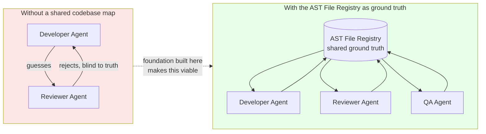

In other words: the single-loop architecture wasn't built as a permanent ceiling on the system's design — it was built as the **stable foundation** that a future multi-agent architecture would need in order to actually work.

---

## 15. Operational Reference: Running the System

1. Ensure Ollama is running (`ollama serve`) with the `qwen3.6:27b` model pulled.
2. Run the startup script:
   ```bash
   ./start.sh
   ```
3. The FastAPI backend boots on `http://127.0.0.1:8088`.
4. The React/Vite frontend boots on `http://localhost:5174`.
5. Open the UI, submit a prompt, and observe the Orchestrator plan, generate, verify, and self-heal the application in real time.

---

## 16. Glossary

| Term | Meaning |
|---|---|
| **Context Window** | The maximum number of tokens an LLM can read and generate in a single call |
| **Massive Input / Output / Compound Case** | The three failure modes that occur when a task exceeds the context window on the input side, output side, or both |
| **Evolution Bottleneck** | The failure mode where an agent cannot safely update an existing massive codebase without regenerating (and breaking) entire files |
| **Hierarchical Master Planner** | V2 Component that turns a user prompt into a multi-staged (Vision -> Subsystem -> Service) dependency-ordered list of files |
| **Dependency Graph** | The ordering of files such that anything a file depends on is written before it |
| **AST File Registry** | The compressed, signatures-only map of the codebase built by the Context Assembler |
| **Neo4j Knowledge Graph** | Graph database that maps the structural dependencies of the AST File Registry to prevent context overflow in massive projects |
| **ChromaDB Semantic Store** | Vector database used to query functional summaries of previously generated files and plans |
| **Deep Semantic Analyzer** | Pipeline (`core/analyzer.py`) that executes Ruff (syntax), Pyright (logic/types), and Semgrep (security) against the codebase |
| **Surgical Editing (`<edit_file>`)** | XML tool allowing agents to inject SEARCH/REPLACE blocks into the middle of massive files without touching surrounding code |
| **Intent Routing** | Orchestrator logic that categorizes follow-up prompts into Bug Fixes or Feature Updates |
| **OKF (Open Knowledge Format)** | Google-designed framework for persisting core architectural and alignment rules directly into the highest-priority agent system prompt |
| **Code Stitching** | The failure where a model forgets or mis-recalls a previously written function's exact name or signature |
| **Deterministic Single-Loop Orchestrator** | The chosen control architecture: one predictable loop driving Planning → Execution → Context Assembly → Verification |
| **Multi-Agent DAG** | An architecture where separate agents (e.g. Developer, Reviewer, QA) hand work to each other in sequence |
| **Self-Healing Loop** | The bounded retry cycle that captures semantic errors and feeds them back into a fix prompt automatically |
| **Venv Isolation** | Giving every generated project its own Python virtual environment to avoid touching the host system |
| **Command Blocklist** | A hard-coded list of destructive shell commands the orchestrator refuses to execute |

---

*End of document.*
